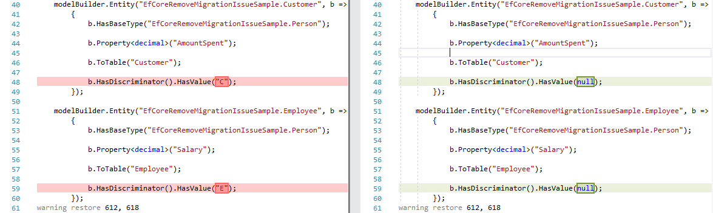

# EfCoreRemoveMigrationIssueSample

Sample project for [Ef Core Issue #13984](https://github.com/aspnet/EntityFrameworkCore/issues/13984).

Remove migration makes invalid changes to `ModelSnapshot` when using `TPH` with discriminator type `char`.

``` csharp
public abstract class Person
{
    public int Id { get; set; }
    public string Name { get; set; }
}
public class Customer : Person
{
    public decimal AmountSpent { get; set; }
}
public class Employee : Person
{
    public decimal Salary { get; set; }
}
```

``` csharp
public class SampleDbContext : DbContext
{
    public DbSet<Person> People { get; set; }
    public DbSet<Customer> Customers { get; set; }
    public DbSet<Employee> Employees { get; set; }

    protected override void OnModelCreating(ModelBuilder modelBuilder)
    {
        modelBuilder.Entity<Person>(b =>
        {
            b.HasDiscriminator<char>("Type")
                .HasValue<Customer>('C')
                .HasValue<Employee>('E');
        });
    }
}
```

Important is the discriminator type `char`. The problem does not occur when using `int`, `short` or `string`. 

#### Repro Steps
 - call Remove-Migration
 - look at changes in Model Snapshot
 - *expected **No Change***
 
 
